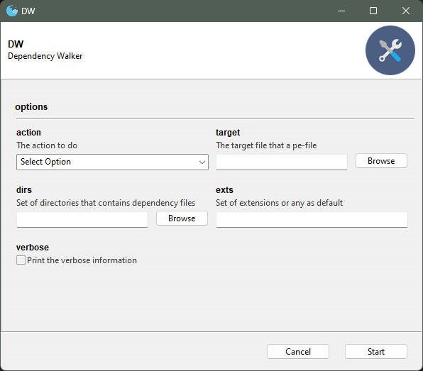
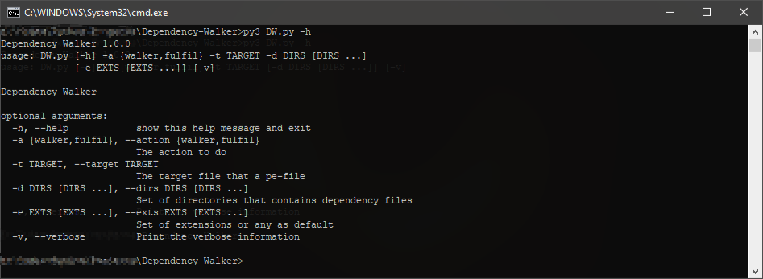
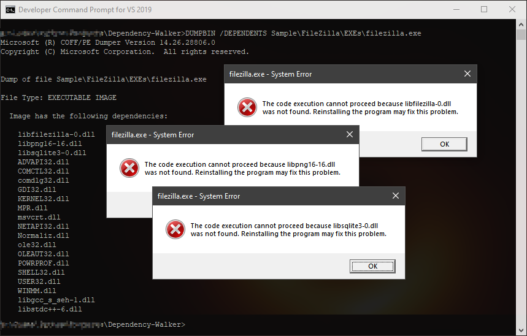
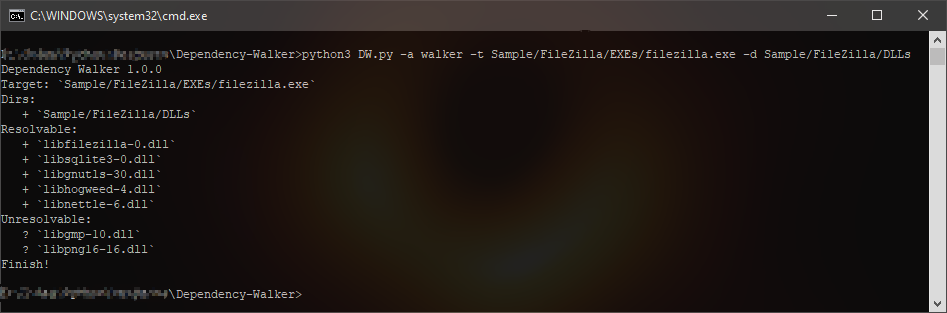
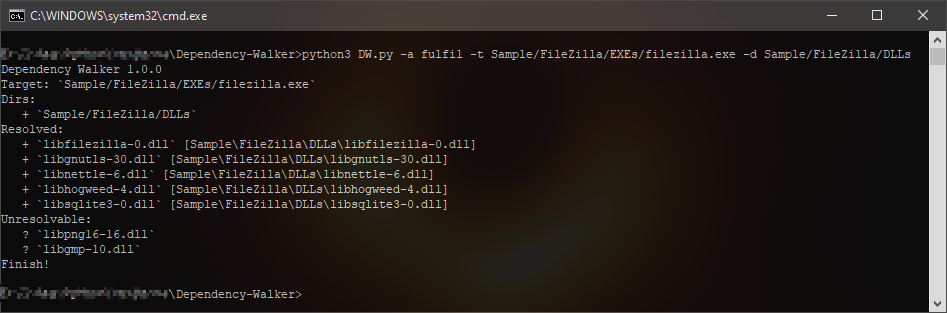
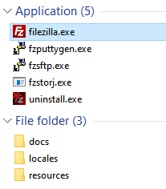
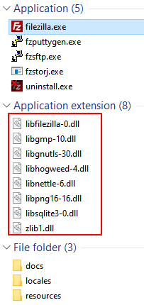
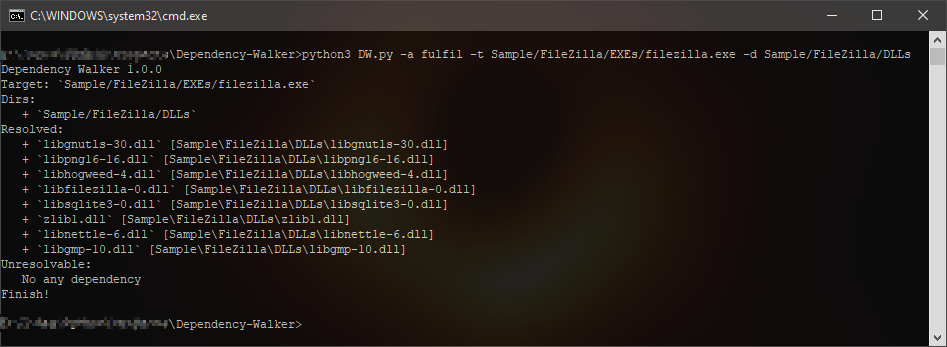

### Dependency Walker CLI ###
_ _ _

Dependency Walker - a tool that recursive listing and fixing-up dependencies of a PE file (exe, dll, ocx, sys, etc) that it depends on several missing dependency modules (dll, ocx, etc).

##### INSTALLATION #####

> Install the [PyVutils](https://github.com/vic4key/PyVutils) library can be found on GitHub
> 
> Install PyInstaller
> 
> Run `builder.cmd` to create a single exe

##### COMMANDS #####

> $ python3 DW.py -h

##### SCREENSHOTS #####

##### GUI Version (by Gooye).

##### CLI Version.

##### Eg. 1.

##### Eg. 2.

_ _ _

Website: https://vic.onl/